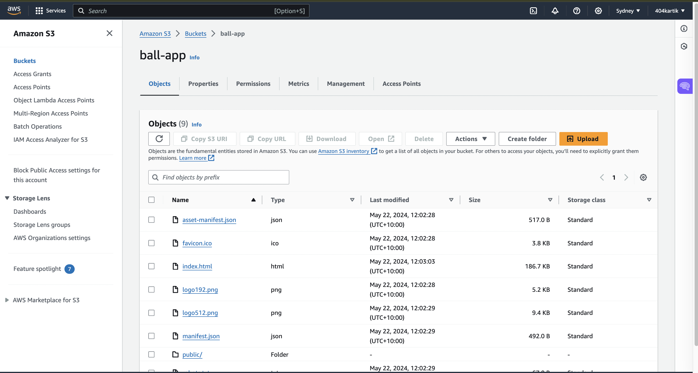

# Ball App
Welcome to Ball App! This simple web application randomly shows users an image of either a red or blue ball upon visiting the page. The color shown to the user is determined randomly, with a 50/50 chance for each color.

### [Visit Ball App](http://ball-app.s3-website-ap-southeast-2.amazonaws.com/)

# Functionality
* Random Color: Upon visiting the page, users are shown an image of either a red or blue ball randomly.
* Remembering User's Choice: The application uses cookies to remember the color of the ball the user saw during their last visit. This ensures that the next time a user visits the page, they will see the same color ball they saw previously.
* Usage Reporting: Ball App keeps track of how many times a user has seen each color of the ball. This information can be used to generate reports on user engagement.

# Deployed on S3

# AWS Codepipeline and Codebuild using Github actions
 
